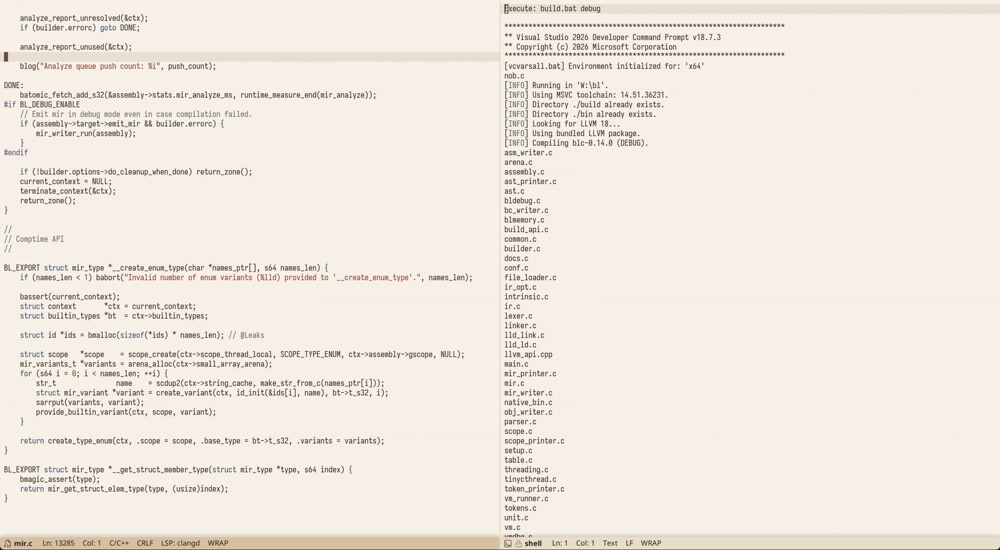

# Tine Code Editor

Fast and lightweight keyboard focused code editor with LSP support and shell integration.



## Supported Languages

  | Language | Syntax Highlight | LSP           |
  | -------- | ---------------- | ------------- |
  | BL       | YES              | NO            |
  | C        | YES              | YES           |
  | C++      | YES              | YES           |
  | CSharp   | YES              | YES           |
  | GLSL     | YES              | NO            |
  | JAI      | YES              | (not tested)  |
  | Markdown | YES (basic)      | NO            |
  | ZIG      | YES              | (not tested)  |

## Feature Highlights

- Lightweight, single-executable distribution on Windows.
- Fast, keyboard-oriented navigation.
- Project-based workspace with search-in-files support.
- Minimalistic user interface.
- Embedded shell execution.
- LSP support.
- Clang-format support.
- Built-in macro system.
- Simple integration with RemedyBG and RAD Debugger on Windows.

## Installation

Download the executable [here](https://travisdp.itch.io/tine) or build from the source code. Once executed for the first time, the `projects` folder and `default.proj` file are created automatically.

- **Windows** - Configuration files will be created next to the editor executable.
- **Linux** - Configuration files will be created in `~/.config/tine` or `~/.tine` folder.
- **macOS** (experimental) - Configuration files will be created in `~/.tine` folder. **Note** the *app* package is not signed, you may run `xattr -d com.apple.quarantine /Applications/Tine.app`.

Optionally, run the `install` editor command to add a link to the executable to the "start" menu (available on Windows and Linux).

## Links

- Download: https://travisdp.itch.io/tine
- Source code: https://github.com/travisdoor/tine
- Compiler: https://github.com/travisdoor/bl
- Discord: https://discord.gg/cmDSGMhwYT
- Zulip: https://tine.zulipchat.com/join/lhnqb53mklvmjmeqzibqa3go

## Tutorials

- Introduction: https://youtu.be/SWHi74XATUE
- RemedyBG workflow: https://youtu.be/2JmT6_gce8g
- Repeat mode & macros: https://youtu.be/8FxoyvfCiOc?si=zEccV3FbVi8l6yvx

## Authors

- **Martin Dorazil** (travis) [**SUPPORT**](https://www.paypal.com/donate/?hosted_button_id=WKSP23ADBFDP6)
- **bovacu**


# Philosophy of Tine

Tine is a simple text/code editor that was initially designed as my primary work tool, so I only implemented features that I personally needed. Over time, however, it became clear that it might also be useful to others.

The main goal of this editor is to keep the focus entirely on text editing and to avoid distractions from buttons, tabs, menus, and animations. Therefore, there is almost no UI. Text navigation and editor interaction are strictly designed for keyboard use (since I dislike moving my hands off the keyboard while typing). However,
some basic mouse support was added later, primarily for situations like quickly presenting code to colleagues.

Because I mostly use C and C++ at work, the editor is primarily optimized for these languages.

Having used Emacs extensively, my Ctrl key is remapped to Caps Lock. I believe this position is far more ergonomic and highly recommend doing the same. The default Tine keybindings rely heavily on the Control key. In addition, the right-hand touch-typing home position is used as the basis for cursor movement (though the arrow keys can also be used).

Tine is heavily inspired by [Focus](https://focus-editor.dev) editor.

# Developer

The Tine text editor is written in a custom programming language called [Biscuit](https://github.com/travisdoor/bl). The latest *master* compiler version is required.

To compile debug version use:

```
blc -build
```

To compile release version use:

```
blc -build --release
```
